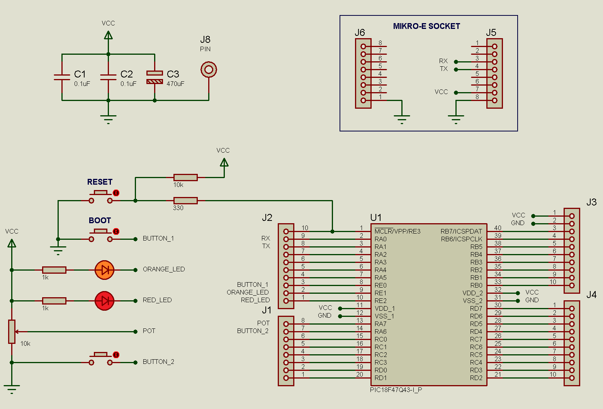
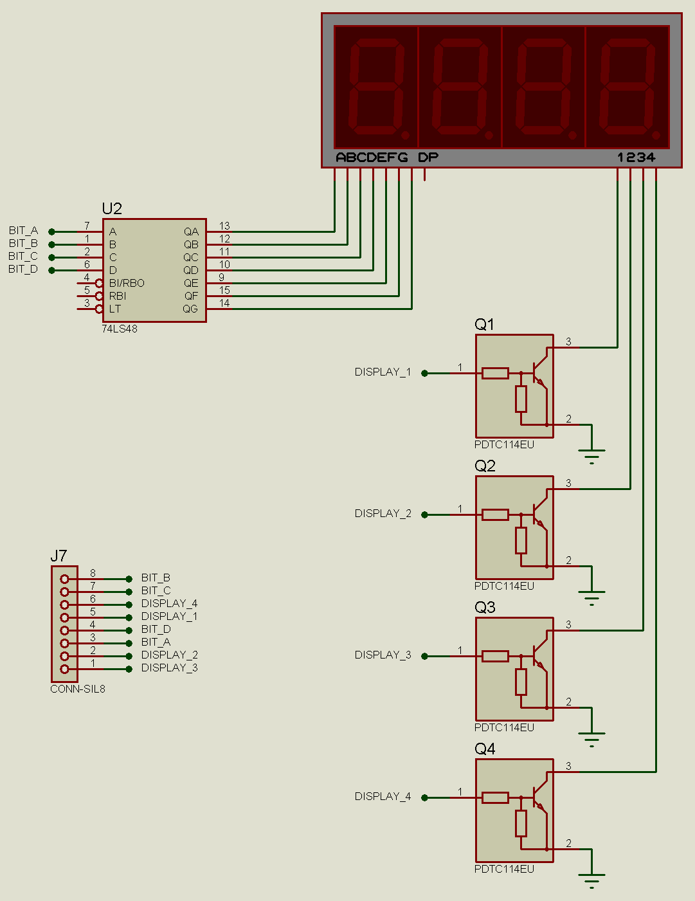

# Display numérico de 4 dígitos con PIC18F47Q43

Este proyecto tiene dos propósitos, el primero es mostrar un código de ejemplo para controlar un display numérico con dígitos de 7 segmentos y el segundo es presentar la configuración básica de una aplicación con interrupciones que corre sobre el [bootloader](https://github.com/SamuelSamsMA/PIC18F47Q43_Bootloader.X.git).

La aplicación en sí es muy sencilla, cada 150 milisegundos se toma lectura de una entrada analógica mediante el ADC y el resultado de 12 bits se imprime en el display.

## Requerimientos de software

+ MPLABX IDE v6.20
+ MPLAB Code Configurator (MCC) v5.5.1
+ Librería de dispositivos
    + PIC10/PIC12/PIC16/PIC18 v5.28.2
+ XC8 Compiler v2.5
+ Microchip Firmware Image Builder
    + pyfwimagebuilder v1.0.1.14 or later
+ Microchip Device Firmware Upgrade
    + pymdfu v2.4.0.8 or later

## Diagramas eléctricos de la aplicación

### Circuito de la tarjeta principal


### Circuito del módulo display numérico


## Configuración del proyecto con el bootloader

Este proyecto ya está configurado de acuerdo a las instrucciones marcadas en el [repositorio](https://github.com/SamuelSamsMA/PIC18F47Q43_Bootloader.X.git) del bootloader, pero hay dos puntos importantes a resaltar cuando se trabaja con interrupciones:

1. La función `remapInterruptVector` en el archivo **main.c** cambia la dirección del vector de interrupciones de alta prioridad a la dirección 2008h de la memoria, debido a que los primeros 2000h bytes son asignados al bootloader.
```c
void remapInterruptVector(void)
{
	INTERRUPT_GlobalInterruptDisable();
	IVTLOCK = 0x55;
	IVTLOCK = 0xAA;
	IVTLOCKbits.IVTLOCKED = 0;
	
	IVTBASEU = 0;
	IVTBASEH = 0x20;
	IVTBASEL = 0x08;
	
	IVTLOCK = 0x55;
	IVTLOCK = 0xAA;
	IVTLOCKbits.IVTLOCKED = 1;
}
```
La secuencia con el registro `IVTLOCK` es necesaria para poder escribir la nueva dirección en los registros `IVTBASE`.

2. Para que el cambio de dirección sea efectivo, también hay que indicar la nueva ubicación en la función de interrupciones en el archivo: **mcc_generated_files/system/src/interrupt.c**, mediante el comando `base()`.
```c
void __interrupt(base(0x2008)) INTERRUPT_InterruptManager (void)
{
    // interrupt handler
    if(PIE15bits.TMR6IE == 1 && PIR15bits.TMR6IF == 1)
    {
        TMR6_ISR();
    }
    else
    {
        //Unhandled Interrupt
    }
}
```